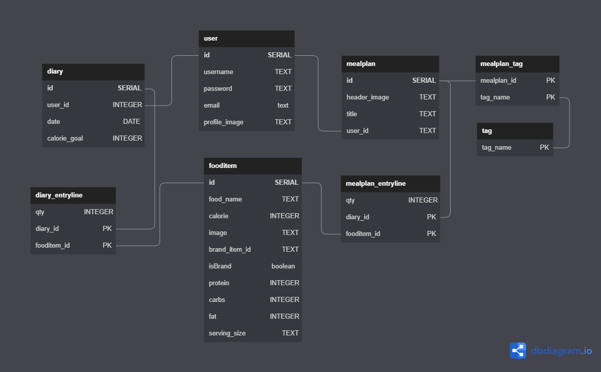

# Nutrition Tracker

## **Overview**

A food tracking app that will allow users to keep a daily diary of what they are eating and track their calories. Users will also be able to create and share meal plans with other users.

## **API Used**

[NutritionIX API](https://developer.nutritionix.com/docs/v2)

## **Database Schema**

## **Tech Stack**
- Frontend
    - React | Javascript | Bootstrap | HTML | CSS
- Backend
    - Flask | Python | SQLAlchemy | PostgreSQL
